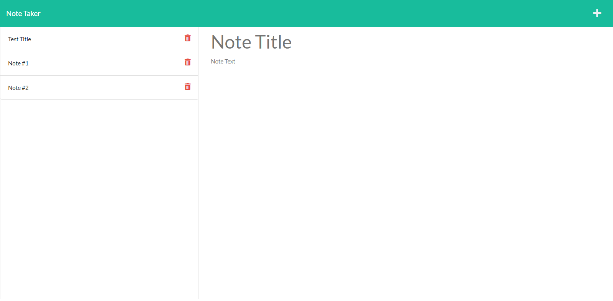
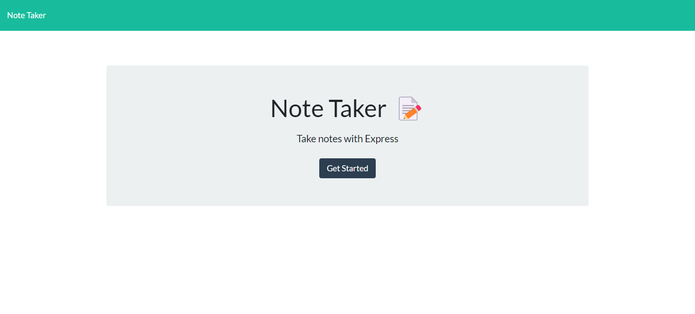

# Express-Note-Taker

## Deploy Link 
https://note-taker212.herokuapp.com/


 ## Table-of-Contents

  * [User Story](#user-story)
  * [Description](#description)
  * [Walkthrough Video](#walkthrough-video)
  * [ScreenShot](#screenshots)

  
 # User-Story
```
AS A small business owner
I WANT to be able to write and save notes
SO THAT I can organize my thoughts and keep track of tasks I need to complete
```
# Description
This is an application that uses the Express.js framework to create a server-side API. This application uses GET and POST requests to view and submit information to the server when the various endpoints are visited. This application allows a user to write notes, view submitted notes, and delete notes.


# Walkthrough-Video

[Walkthrough Video Link](https://drive.google.com/file/d/1jWcmRBDb91xBpwz1WlUDXxHCVjUiPlN5/view)


# ScreenShots 





